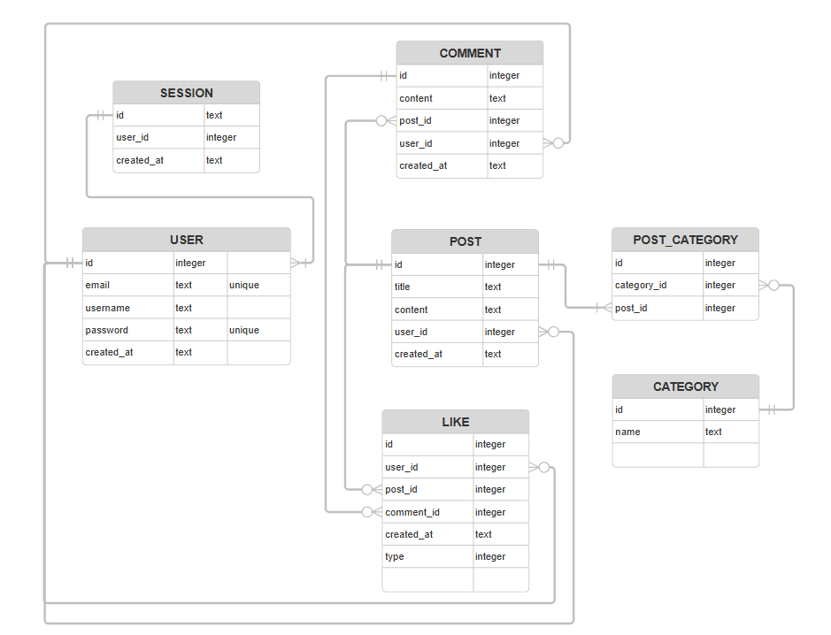

# Forum-git

Github repo for the Forum project at grit:lab

# Usage

Use with Docker: First give user rights to the shell script 'chmod +x docker.sh'
Do ./docker.sh
now open the container in docker

You can also run the program with go run .

# ER Diagram

# Authentication
Once the user logs in, they are given a UUID token in a session cookie. This token is used to authenticate the user. The token is stored in the database and is used to authenticate the user. When an user logs out, the token is deleted from the database. When a user is registering, we store is username and hashed password with bcrypt in the database.

# Frontend

# Backend